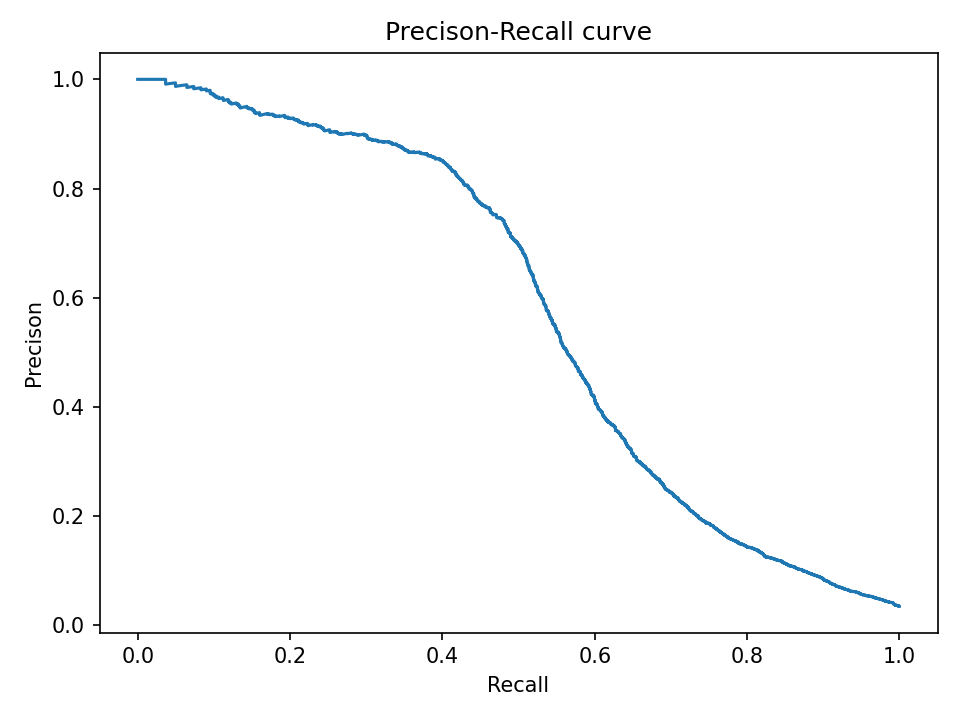
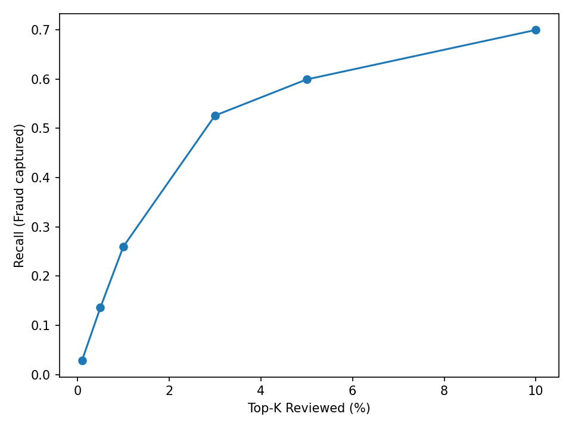
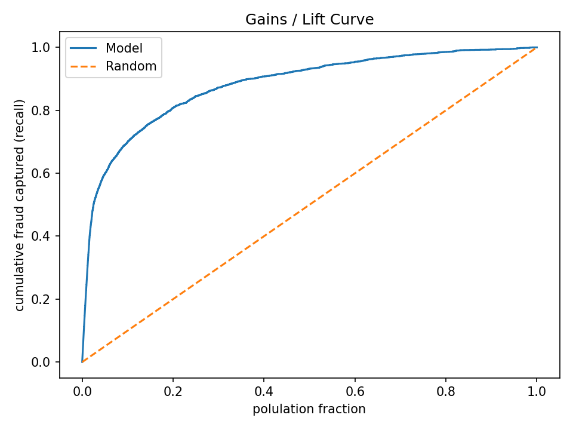
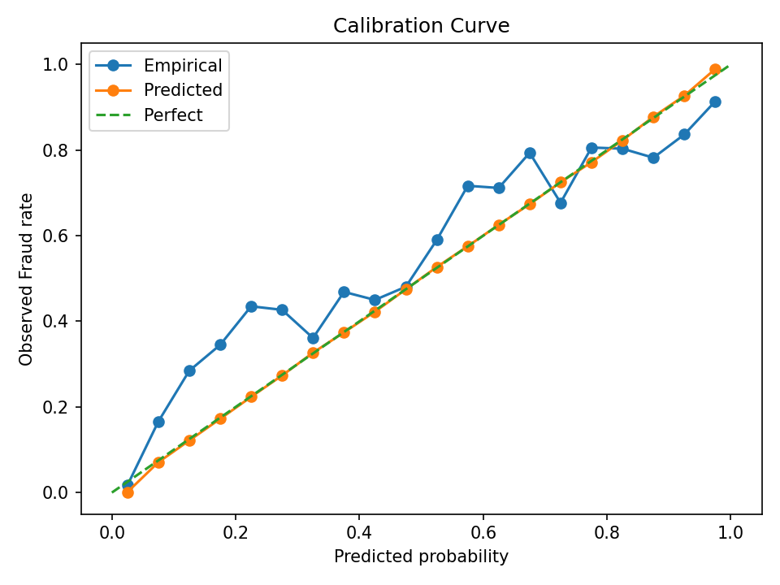
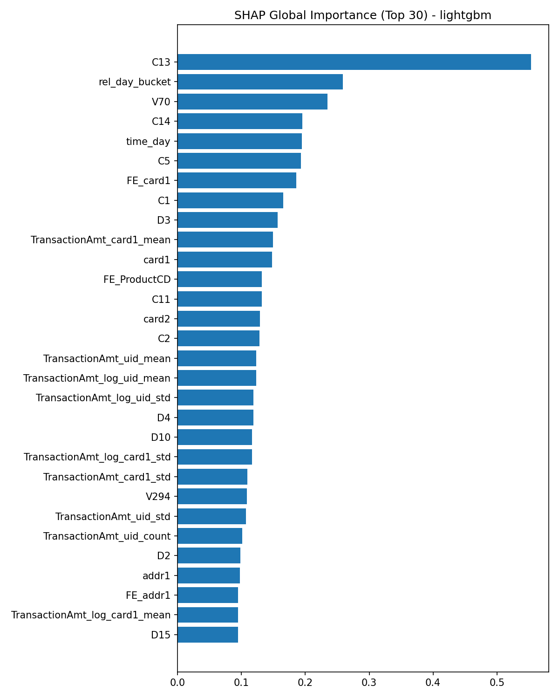
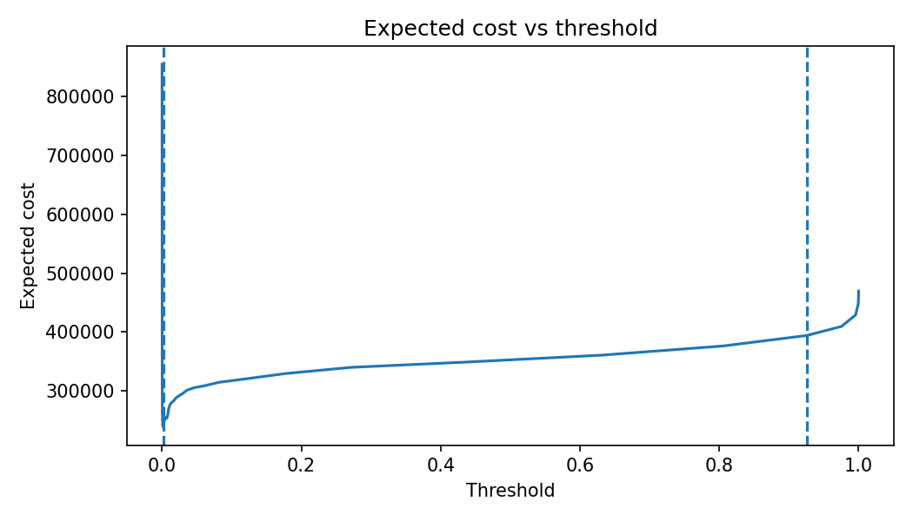
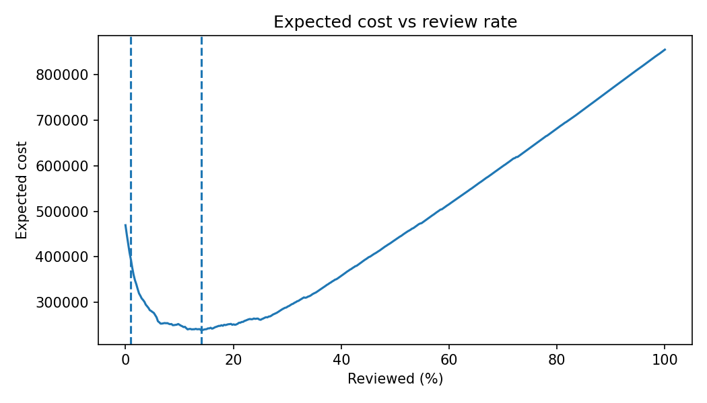
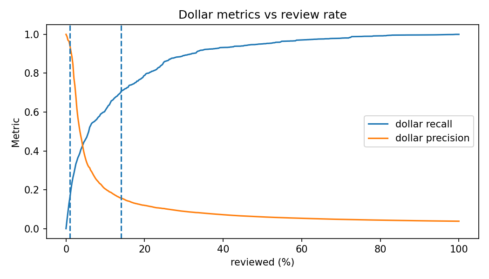
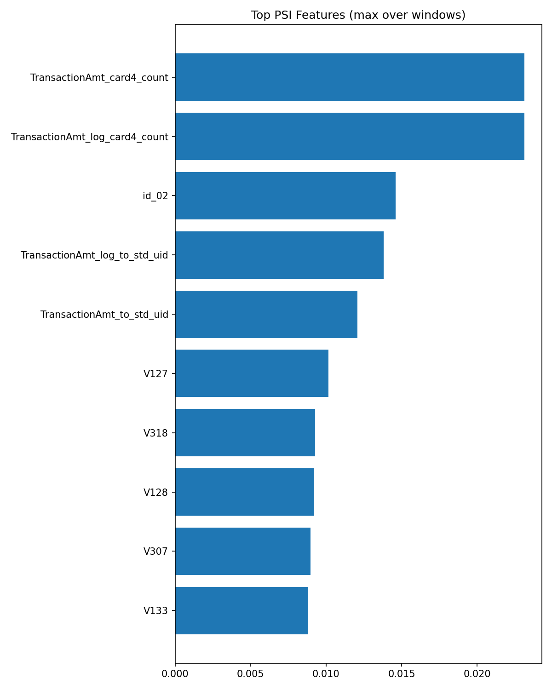
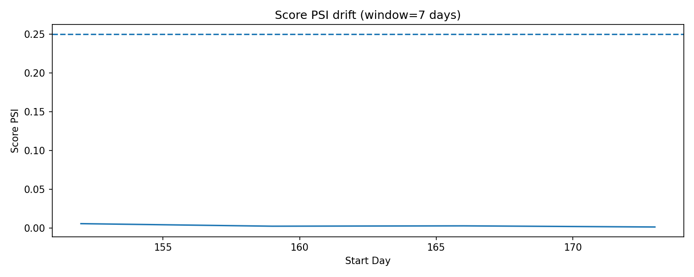

# IEEE-CIS 反欺诈风控建模项目（End-to-End Risk Modelling Pipeline）

目标：基于 IEEE-CIS Fraud Detection 数据（Transaction + Identity 表）搭建一套 **可复现、可解释、可落地** 的风控建模流水线，输出业务侧可直接使用的指标、策略模拟与监控包。

---

## 1. 主要结果（Out-of-Time 测试集）
- **主模型：LightGBM（CPU）** 在 OOT Test 上达到 **PR-AUC=0.5724 / ROC-AUC=0.8962 / KS=0.6333**
- 审核产能（Top-K Review）视角（Test）：
  - **Top 1% 审核**：Precision≈**0.904**，Recall≈**0.260**
  - **Top 3% 审核**：Precision≈**0.610**，Recall≈**0.526**
  - **Top 10% 审核**：Precision≈**0.244**，Recall≈**0.700**
- 产出完整闭环：**模型评估 → 策略阈值/成本权衡 → 监控（PSI/Score Drift）→ 可解释（SHAP/Reason Codes）**

---

## 2. 复现说明
- 配置文件：`configs/config.yaml`
- Kaggle 原始数据未上传 GitHub：复现需要自行放入 `data/raw/`

### 一键运行（从 repo 根目录）
```bash
conda env create -f environment.yml
conda activate riskmodel

python -m src.00_check_data
python -m src.01_make_dataset
python -m src.02_feature_engineering
python -m src.03_train_models
python -m src.04_evaluate
python -m src.05_explain_shap
python -m src.06_policy_simulation
python -m src.07_monitoring_pack
```


## 3. 验证方式：Leakage-aware 时间切分（OOT）

本项目采用 **时间顺序切分（Out-of-Time, OOT）** 作为主要评估方式：按 `time_day` 从早到晚排序，将数据划分为 train / valid / test。  
这样做的原因是反欺诈场景存在明显的 **时间漂移** 与 **实体重复（同卡/同设备/同邮箱域名等）**，随机划分往往会引入信息泄露并高估效果；OOT 更贴近真实线上部署。

- 主要评估：Time-based split（OOT）
- 关键业务指标：PR-AUC、KS、Recall@TopK、Precision@TopK、Calibration
- 目标：在“有限审核产能”约束下最大化捕获欺诈（Top-K）

---

## 4. 模型表现（Base Models + Stacking）

### 4.1 Base Models：LightGBM vs XGBoost（Valid / Test）

| Model | Split | PR-AUC | ROC-AUC | KS | Brier |
|------|------|--------:|--------:|---:|------:|
| LightGBM | Valid | 0.6919 | 0.9340 | 0.7337 | 0.01830 |
| **LightGBM** | **Test** | **0.5724** | **0.8962** | **0.6333** | **0.02138** |
| XGBoost | Valid | 0.6273 | 0.8864 | 0.6378 | 0.01818 |
| XGBoost | Test | 0.5281 | 0.8476 | 0.5532 | 0.02161 |

结论（业务化解读）：
- LightGBM 在 Valid/Test 全面优于 XGBoost，尤其在 **PR-AUC** 与 **KS** 上更强，适合当前特征与缺失模式。
- Test 上 PR-AUC 低于 Valid 属于 OOT 更严格评估的正常现象（时间漂移 + 难样本更集中）。

对应输出文件：
- `artifacts/metrics/holdout_metrics.json`
- `artifacts/metrics/topk_table.csv`

### 4.2 Stacking（二层学习：用 base score 作为输入）

| Stacking | Test PR-AUC | Test ROC-AUC | Test KS |
|---------|------------:|-------------:|--------:|
| Linear（logit on scores） | 0.5576 | 0.8625 | 0.5789 |
| GBM Meta（gbm on scores） | 0.5674 | 0.8883 | 0.6221 |

备注：
- 本次 stacking 未超过单一 LightGBM（PR-AUC 0.5724）。  
- 常见原因：base 模型相关性高；二层训练样本有限；未做严格 OOF stacking。  
- 可作为“下一步工作”：K 折 OOF 生成二层训练集 + 正则化/校准提升泛化。

---

## 5. 业务指标：审核产能视角（Precision@TopK / Recall@TopK）

以下为 **Test 集**：

| Review Top-K | Precision@K | Recall@K |
|-------------:|------------:|---------:|
| 0.1% | 1.0000 | 0.0289 |
| 0.5% | 0.9481 | 0.1362 |
| **1%** | **0.9041** | **0.2598** |
| **3%** | **0.6102** | **0.5261** |
| 5% | 0.4172 | 0.5994 |
| 10% | 0.2436 | 0.7000 |

业务解读（面试可直接讲）：
- 若每天只能人工审核 **1% 订单**：可捕获约 **26% 欺诈**，且拦截样本中约 **90% 为欺诈**（高精度）。
- 若扩大到 **3% 审核产能**：可捕获约 **53% 欺诈**，精度约 **61%**，召回提升明显。

---

## 6. 可视化结果

PR 曲线（LightGBM Test）  


TopK 捕获曲线（LightGBM Test）  


Lift 曲线（LightGBM Test）  


（可选）Calibration（LightGBM Test）  


---

## 7. 可解释性：SHAP + Reason Codes

- 全局解释：SHAP Summary（关键驱动因素）
- 局部解释：local cases（高风险订单的可解释证据）
- 原因码（Reason Codes）：输出每条样本 Top-N 正向贡献特征，便于策略/运营使用

SHAP Summary  


原因码示例文件：`artifacts/outputs/reason_codes_sample.csv`

---

## 8. 策略模拟（Policy Simulation）：阈值、成本、审核率权衡

将模型分数落地为策略：扫描阈值/审核比例，计算 期望成本（FP 摩擦成本 + FN 金额损失），输出策略推荐表与阈值文件。

- 表格：`artifacts/policy/policy_tradeoff_table.csv`
- 阈值：`artifacts/policy/threshold.json`

成本-阈值曲线  


成本-审核率曲线  


金额相关指标（Dollar Metrics）  


---

## 9. 监控包（Monitoring Pack）：PSI + Score Drift

提供上线监控资产（可用于周/月巡检）：
- `artifacts/monitoring/psi_report.csv`
- `artifacts/plots/psi_top_features.png`
- `artifacts/monitoring/score_drift.csv`
- `artifacts/plots/score_drift.png`

PSI Top Features  


Score Drift（滚动窗口）  

